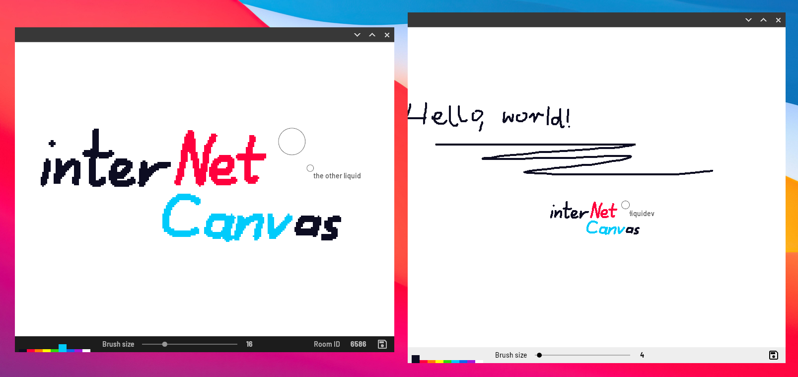

# NetCanv

A lightweight painting app for painting with other people over the Internet, in real time.


<p align="center">
A screenshot of my imaginary friend and I painting things together using NetCanv.
</p>


## Compiling

Should be as simple as:

```sh
$ cargo build --release
# or, if you just want to run the app:
$ cargo run --release
```

### Matchmaker

NetCanv assumes that you have your own matchmaker up: currently the default value
in the matchmaker textbox is `localhost`, for easy testing.

To run the matchmaker, simply do:
```sh
$ cd netcanv-matchmaker
$ cargo run --release
```

This will allow you to host and join new rooms locally.

## Tutorial

NetCanv was originally made as part of a YouTube tutorial series.

The series is in Polish (!) and can be found on
[YouTube](https://www.youtube.com/playlist?list=PL1Hg-PZUNFkeRdErHKx3Z7IwhJNgij3bJ).

Individual episodes:

1. [Introduction](https://www.youtube.com/watch?v=ZeSXVgjrivY)
2. [Drawing and GUI](https://www.youtube.com/watch?v=MVEILFrPKnY)
3. [Refactoring and ∞](https://www.youtube.com/watch?v=mECVCb87sAQ)
4. Networking – coming soon

Again, note that the tutorials are in Polish.

### Purpose

The main purpose of this tutorial series is to show how to build a desktop app
using Rust and Skia, together with peer-to-peer communication for realtime
collaboration.

I generally don't like explaining every small detail in my tutorials. I'd rather
showcase the cool and interesting parts about the development process. So don't
consider this as a general Rust application development tutorial – treat it more
like a devlog with some educational, comedic, and artistic value sprinkled
over it.
